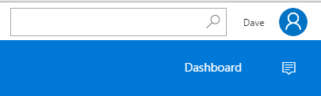
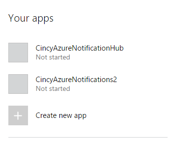

# Building a basic notification based app

* Access the [Windows Developer Portal](https://developer.microsoft.com/en-us/windows/windows-apps) **Note there is membership fee to develop windows apps*
* Sign in and then click "dashboard" to see your apps or create a new app



* Click "Create new app"



* Give your app a unique name


* Click "Services", followed by "Push Notification"


* Click "Live Services site"


* Make note of the App Secret and Package SID


* Log into the [Azure Portal](https://portal.azure.com)

* Click "New" and search for "Notifcation Hub"


* Once the notification hub has been provisioned, select it from your Azure Portal start page.  Click "Notification Services" -> "Windows (WNS)" and set the Package SID and Security Key (App Secret) that were noted above


* Open Visual Studio 2015, and create a new Windows Universal App


* Right click on the project, select "Store" and then "Associate App with the Store".  Proceed through the dialogs to associate the project with the Windows Store App we created earlier


* Add the "WindowsAzure.Messsaging.Managed" nuget package


* Open "App.xaml.cs" and add the below using statements

```
using Windows.Networking.PushNotifications;
using Microsoft.WindowsAzure.Messaging;
using Windows.UI.Popups;
```

* Add the below method to "App.xaml.cs"

```
private async void InitNotificationsAsync()
{
    var channel = await PushNotificationChannelManager.CreatePushNotificationChannelForApplicationAsync();

    var hub = new NotificationHub("<hub name>", "<connection string with listen access>");
    var result = await hub.RegisterNativeAsync(channel.Uri);

    // Displays the registration ID so you know it was successful
    if (result.RegistrationId != null)
    {
        var dialog = new MessageDialog("Registration successful: " + result.RegistrationId);
        dialog.Commands.Add(new UICommand("OK"));
        await dialog.ShowAsync();
    }

}
```

* Add the below line to the beginning of the "OnLaunched" method in "App.xaml.cs"

```
InitNotificationsAsync();
```

* Hit "F5" to install and debug your application

* Browse to the [Azure Portal](https://portal.azure.com) and access your notification hub

* Click "Test Send", Select "Windows" as your platform, and "Toast" as your notification type, then click send


* If your app is installed and running, you should receive a new Push Notification!